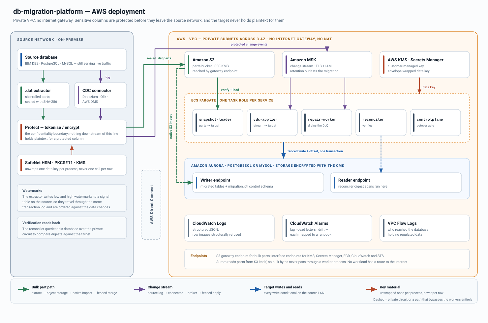
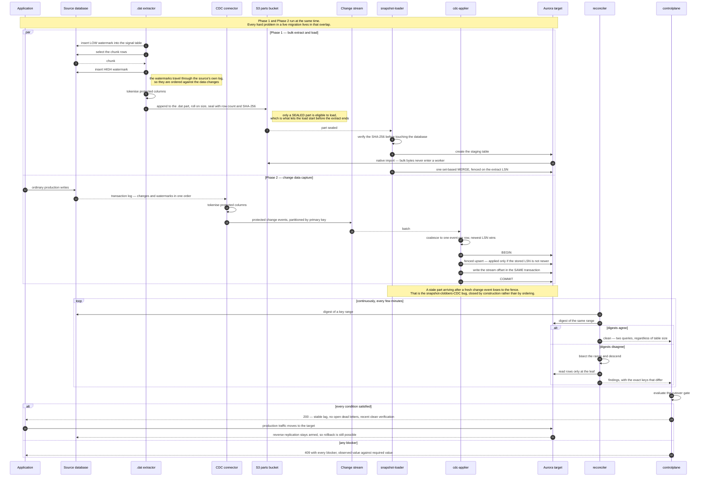

# db-migration-platform

A zero-downtime, self-verifying database migration platform for moving a large
production database to a new engine while it stays online.

It was built for the specific shape of problem that keeps going wrong in
practice: a multi-terabyte source, millions of changes a day, regulated data that
must not appear in plaintext outside its original network, and a business that
cannot tolerate either an outage or a silently incorrect target.

---

## The problem this solves

Almost every heterogeneous migration follows the same outline. Unload the source
in bulk. Capture changes concurrently. Load the bulk data. Catch up. Cut over.

The outline is right. What goes wrong is in the seams, and the failures are
almost all silent:

| What goes wrong | Why it is hard to catch |
|---|---|
| A snapshot row loaded after a concurrent change overwrites the newer value | No error, no log line. Surfaces weeks later as "some accounts have old balances" |
| The gap between "snapshot taken" and "CDC started" loses every change in between | The counts still match |
| A `.dat` part truncated by a full disk loads cleanly, minus some rows | Counts differ by an amount nobody has a baseline for |
| An offset committed separately from the data re-applies or skips a batch after a crash | Only visible if you happen to reconcile that exact range |
| CHAR padding, decimal scale and NULL-vs-empty-string differ between engines | Every row is subtly wrong, and row counts are identical |
| One unmigratable row stalls a partition | Progress stops; nothing errors |
| Cutover happens because the dashboard looked green | The reasons it should not have are discovered afterwards |

This platform is organised around the position that a migration which cannot
*demonstrate* correctness has not finished, it has only stopped.

---

## How it works

### Deployment

<p align="center">
  
</p>

<p align="center">
  <sub>
    Download <a href="docs/diagrams/aws-architecture.svg"><b>SVG</b></a> ·
    <a href="docs/diagrams/aws-architecture.png"><b>PNG</b></a> ·
    regenerate with <code>python3 docs/diagrams/generate_aws_architecture.py &gt; docs/diagrams/aws-architecture.svg</code>
  </sub>
</p>

Two things in that picture carry most of the design.

The **confidentiality boundary** sits inside the source network, not at the
loader. Protected columns are tokenised before anything crosses Direct Connect,
so the parts bucket, the broker, the services and the target all hold tokens
rather than plaintext. The HSM is called once per process to unwrap a data key,
never once per row — an HSM does low thousands of operations per second and a
migration needs millions.

The **bulk path never passes through a worker**. Aurora reads parts from S3
itself through the gateway endpoint, so a terabyte of extract does not get
marshalled through a Go process on its way into the database. The workers issue
the statements; the bytes take a different route.

### Sequence — the two phases overlap, and that overlap is the problem

Phase 1 and Phase 2 are not sequential. The extract runs while production keeps
writing, which is what makes a live migration hard and what every mechanism below
exists to survive.



<p align="center">
  <sub>
    Download <a href="docs/diagrams/migration-sequence.svg"><b>SVG</b></a> ·
    <a href="docs/diagrams/migration-sequence.png"><b>PNG</b></a> ·
    source <a href="docs/diagrams/migration-sequence.mmd"><b>.mmd</b></a>
  </sub>
</p>

### Flow — every path a row can take, failures included

Both paths converge on a single decision: the LSN fence. That convergence is the
whole design. Because every write is conditional on the source change sequence
number, arrival order stops mattering — a replayed batch, a retried statement, a
dead letter drained forty minutes late and a stale snapshot part all resolve to
the same correct state.

```mermaid
%% Event lifecycle — every path a single row can take through the platform,
%% including the failure paths, which are most of the value.
%% ---
%% The shape worth noticing: both paths converge on one decision, the LSN fence.
%% That convergence is the design. It is why arrival order stops mattering, and
%% why replay, retry and a late dead letter are all safe.
flowchart LR
    SRC[("Source database<br/>still serving traffic")]:::src

    subgraph BULK["Phase 1 · bulk part path"]
        direction TB
        A1["Chunk read between the<br/>low and high watermarks"]:::store
        A2["Tokenise protected columns"]:::sec
        A3["Roll and SEAL the part<br/>row count + SHA-256"]:::store
        A4{"Digest<br/>verifies?"}:::store
        A5["Re-stage. A truncated part<br/>loads cleanly and omits rows"]:::fail
        A6["Native S3 import,<br/>then one set-based MERGE"]:::store
        A1 --> A2 --> A3 --> A4
        A4 -- "no" --> A5 --> A3
        A4 -- "yes" --> A6
    end

    subgraph STRM["Phase 2 · change stream path"]
        direction TB
        B1["Read the transaction log"]:::strm
        B2["Tokenise protected columns"]:::sec
        B3["Broker, partitioned<br/>by primary key"]:::strm
        B4["Coalesce the batch,<br/>newest LSN per row wins"]:::strm
        B1 --> B2 --> B3 --> B4
    end

    SRC -- "existed before<br/>the extract" --> A1
    SRC -- "changed during<br/>the migration" --> B1

    A6 --> F
    B4 --> F
    F{"LSN FENCE<br/>is the incoming LSN not older<br/>than the one on the row?"}:::fence

    F -- "no" --> DROP["Discard. A stale write<br/>can never win"]:::ok
    F -- "yes" --> W["The row AND the stream offset,<br/>in ONE transaction"]:::data
    W --> OK{"Committed?"}:::data
    OK -- "yes" --> DONE["Applied"]:::ok

    subgraph FAILS["When a write fails"]
        direction TB
        CL{"Transient or<br/>permanent?"}:::fail
        RT["Backoff with full jitter,<br/>so recovery meets no retry storm"]:::fail
        BI["Bisect the batch to isolate<br/>the offending record"]:::fail
        REST["The rest of the batch<br/>applies normally"]:::ok
        DLQ["Dead-letter it: original bytes,<br/>encrypted, in a table that<br/>outlives any topic retention"]:::fail
        RW["repair-worker claims it<br/>with SKIP LOCKED"]:::fail
        BG{"Retry budget<br/>left?"}:::fail
        Q["QUARANTINE — terminal.<br/>A record that keeps failing<br/>is a signal, not noise"]:::fail
        CL -- "transient" --> RT
        CL -- "permanent" --> BI
        BI --> REST
        BI --> DLQ --> RW --> BG
        BG -- "no" --> Q
    end

    OK -- "no" --> CL
    RT --> W
    BG -- "yes" --> W

    DONE --> V
    DROP --> V
    REST --> V
    V["Compare range digests<br/>on both databases"]:::verify
    V --> VD{"Digests<br/>agree?"}:::verify
    VD -- "yes · two queries,<br/>whatever the table size" --> G
    VD -- "no" --> DS["Bisect to the exact rows.<br/>Logarithmic, not linear"]:::verify
    DS --> G

    G{"CUTOVER GATE<br/>stable lag · no open dead letters<br/>recent clean verification<br/>every part loaded · rollback armed"}:::gate
    Q --> G
    G -- "all satisfied" --> CUT(["200 — repoint the application,<br/>rollback still possible"]):::ok
    G -- "any blocker" --> BL["409 with every blocker at once,<br/>observed against required"]:::fail
    BL --> V

    classDef src fill:#EDF2F7,stroke:#8497AB,stroke-width:1.5px,color:#16212E
    classDef store fill:#EAF5EF,stroke:#2E7D57,stroke-width:1.5px,color:#16212E
    classDef strm fill:#F1ECF7,stroke:#6A4C93,stroke-width:1.5px,color:#16212E
    classDef sec fill:#FAEDE9,stroke:#B4472A,stroke-width:1.5px,color:#16212E
    classDef data fill:#E9F1FB,stroke:#1F5FA9,stroke-width:1.5px,color:#16212E
    classDef fence fill:#FFE9C7,stroke:#E08B2E,stroke-width:3px,color:#16212E
    classDef ok fill:#E6F4EC,stroke:#2E7D57,stroke-width:1.5px,color:#16212E
    classDef fail fill:#FBECE8,stroke:#B4472A,stroke-width:1.5px,color:#16212E
    classDef verify fill:#EAF5EF,stroke:#2E7D57,stroke-width:1.5px,color:#16212E
    classDef gate fill:#FFE9C7,stroke:#E08B2E,stroke-width:3px,color:#16212E

    style BULK fill:#F6FAF8,stroke:#2E7D57,stroke-width:1.5px,color:#2E7D57
    style STRM fill:#F8F6FB,stroke:#6A4C93,stroke-width:1.5px,color:#6A4C93
    style FAILS fill:#FDF6F4,stroke:#B4472A,stroke-width:1.5px,color:#B4472A
```



<p align="center">
  <sub>
    Download <a href="docs/diagrams/event-lifecycle-flow.svg"><b>SVG</b></a> ·
    <a href="docs/diagrams/event-lifecycle-flow.png"><b>PNG</b></a> ·
    source <a href="docs/diagrams/event-lifecycle-flow.mmd"><b>.mmd</b></a>
  </sub>
</p>

Full detail, including the watermark protocol and the failure analysis behind
each decision, is in [`docs/architecture.md`](docs/architecture.md).

---

## The five ideas that do the work

### 1. Every write is fenced on the source change sequence number

Each migrated table carries a `_mig_lsn` column, and every write — from the bulk
loader and from the change applier alike — is conditional on the incoming LSN
being at least as new as the one already on the row.

```sql
INSERT INTO app.accounts (...) VALUES (...)
ON CONFLICT (account_id) DO UPDATE SET ...
WHERE app.accounts._mig_lsn <= EXCLUDED._mig_lsn
```

This single predicate is what makes the pipeline safe under replay, retry and
reordering. A stale snapshot part landing after a fresh change event loses. A
Kafka redelivery is a no-op. A dead letter replayed forty minutes late cannot
resurrect an old value. None of that requires the rest of the system to be
careful about ordering, which is fortunate, because at scale it cannot be.

Deletes write a tombstone rather than removing the row, because a removed row
loses its LSN and a delayed older update would then re-insert it.

### 2. The stream offset is committed inside the data transaction

Kafka gives at-least-once delivery. The usual response — "make the writes
idempotent" — is necessary but not sufficient: if the offset commits separately
from the data, a crash between the two re-applies a whole batch or skips one.

Here `migration_ctl.applied_offset` is written in the same transaction as the
rows it accounts for, and the consumer is positioned from that table on startup
rather than from the broker's committed offset. At-least-once delivery becomes
effectively-once application, with no distributed transaction anywhere.

### 3. The snapshot/CDC boundary is closed with watermarks, not with hope

The extractor writes a low watermark to a signal table, reads a chunk, writes a
high watermark. Because the watermarks travel through the source's own
transaction log, they have a defined position relative to the data changes. While
the window is open, any change event evicts its key from the buffered chunk — the
log has a fresher version, so the snapshot's copy is known to be stale.

There is no source locking, no long-lived snapshot, and no gap. The technique is
Netflix's DBLog; the implementation is in
[`internal/snapshot/window.go`](internal/snapshot/window.go) and is exhaustively
unit tested, because it is otherwise very hard to observe in production.

### 4. Verification is hierarchical, so proving correctness is cheap

Both databases compute an order-independent digest over a key range; only the
digests cross the network. When they disagree, the range is bisected and the
comparison repeats, so localising a discrepancy is logarithmic in table size.
Only at the leaves are actual rows read.

A billion-row table that is correct costs **two queries** to prove. One with three
bad rows costs a few dozen. That asymmetry is what makes verification affordable
enough to run *during* the migration rather than at the end, when the only
remaining option is to start over.

The digests are generated per dialect specifically so that a DB2-shaped row and
an Aurora-shaped row of the same logical content hash identically — CHAR padding
trimmed, decimal scale pinned, timestamps forced to UTC at fixed precision, NULL
mapped to a sentinel that cannot occur in data. Without that normalisation every
row mismatches and the whole exercise is worthless.

### 5. Sensitive data is protected before it leaves the source network

Columns marked `tokenize` are replaced with deterministic, format-preserving
tokens on the source side. The target stores tokens permanently and never holds
plaintext, which keeps it out of scope for those columns while still supporting
equality joins, indexes and reconciliation.

This is a deliberate departure from the common pattern of "encrypt in transit,
decrypt at the loader, insert plaintext". That pattern protects the wire, which
TLS already did, and leaves plaintext at rest in the target and in the loader's
memory — buying key custody and nothing else while paying the full operational
cost of an HSM in the hot path.

The key store is called **once per process** to unwrap a data key; every row after
that is a local AES operation. Calling an HSM per row makes HSM
operations-per-second the rate limiter for the entire migration.

---

## What happens when something fails

Failure handling is not a footnote here; it is most of the value.

**One bad row must never stop the stream.** When a batch fails for a
non-transient reason, the applier bisects it to isolate the offending records,
applies everything else, and dead-letters only what actually failed. A failing
batch of 500 costs about nine extra round trips to reduce to the one record that
is broken.

**Transient and permanent failures are treated differently.** A deadlock, a
serialisation failure or a connection reset is retried with exponential backoff
and full jitter. A constraint violation, a type overflow or a decode failure is
quarantined immediately — retrying it will fail identically forever while
blocking everything behind it. Anything unclassifiable is retried within a
bounded budget and then quarantined, so a novel failure degrades into a dead
letter rather than an infinite loop.

**Full jitter, not exponential-plus-a-nudge.** When a target sheds load, every
worker fails at nearly the same instant. Without full jitter they all retry at
the same instant too, and the recovering database is knocked over by the retry
storm it just caused.

**Dead letters live in a table, not a topic.** A dead letter routed to a topic
inherits the topic's retention: a record that failed on Friday may not exist by
Monday. In a table it survives until somebody resolves it, is queryable by table,
error class or age, and is counted by the same cutover gate as everything else.
Payloads are stored encrypted, because the table is a durable copy of production
data with a longer retention than the pipeline.

**Quarantine is terminal and needs a person.** A record that keeps failing is a
signal. Retrying it forever turns that signal into background noise.

---

## Cutover is a predicate, not a judgement call

Repointing the application at the target is the one step that is genuinely hard
to undo. So the decision is not left to someone reading a dashboard at 2am:

```
GET /v1/cutover/readiness   →  200 if open, 409 with every blocker if closed
```

The gate requires all of:

- replication lag under threshold, and **stably** under it for a sustained window
- zero open dead letters (pending, retrying or quarantined)
- zero reconciliation findings, from a pass that is **recent** — a clean result
  from six hours ago says nothing about the last six hours
- every extracted part loaded
- reverse replication armed, so a rollback does not discard everything the
  business wrote after cutover

Every blocker is reported at once, quantified, with the observed and required
values — an operator planning a window needs the whole list, not one discovery at
a time.

An override exists, requires a named author and a substantive reason, must
acknowledge every *currently active* blocker, and is written to an audit table.
Refusing to provide an override does not stop anyone cutting over; it just moves
the action somewhere nothing records it.

---

## Repository layout

```
cmd/
  cdc-applier/      steady-state change application
  snapshot-loader/  bulk part loading
  reconciler/       continuous verification
  repair-worker/    dead-letter drain
  controlplane/     status API and cutover gate
internal/
  model/       domain types; canonical row keys
  dialect/     ALL engine-specific SQL, Postgres + MySQL
  snapshot/    part writer, manifests, watermark protocol
  sink/        transactional applier, coalescing, failure bisection
  recon/       hierarchical digest comparison and bisection
  dlq/         dead-letter lifecycle and retry decisions
  control/     migration state machine and cutover gate
  crypto/      tokenisation, ciphers, key sources
  cdc/         connector envelope decoding
  errclass/    transient vs permanent classification
  retryx/      exponential backoff with full jitter
  obs/         logging with PII redaction, metrics, health
  store/       control-schema persistence
  config/      configuration and plan loading
migrations/    control schema DDL for both engines
deploy/        Terraform, Dockerfiles, Compose stack
docs/          architecture, ADRs, runbooks, scale, security
```

---

## Getting started

```bash
make test          # unit tests, no external dependencies required
make lint          # golangci-lint
make build         # all five binaries into ./bin
make up            # local stack: Postgres, MySQL, Kafka, the services
make migrate-pg    # apply the control schema
```

Run a service against a config:

```bash
./bin/cdc-applier -config examples/config.postgres.json -plan examples/plan.json
./bin/cdc-applier -config examples/config.postgres.json -dry-run   # validate only
```

Secrets are read from the environment, never from the config file, so the file is
safe to commit:

```bash
export TARGET_DSN='postgres://…'
export SOURCE_DSN='postgres://…'
export MIGRATION_STATIC_KEY="$(openssl rand -base64 32)"   # development only
```

---

## Deliberate non-goals

Being explicit about what this does *not* do is as useful as the feature list:

- **It does not implement a CDC connector.** Reading a DB2 or Oracle transaction
  log correctly is a large, specialised problem that Debezium, Qlik Replicate and
  DMS have already solved. This consumes their output.
- **It does not automate index drop and recreate.** That is a real optimisation,
  but the folklore tricks for it are either unsupported on the storage engine in
  question or can leave the catalogue needing a restore. It belongs in a runbook
  with a rollback plan, not in a worker process acting on a production table.
- **It does not ship a KMS or PKCS#11 client.** Both reduce to a one-method
  `Unwrapper` interface. The concrete implementation needs credentials and
  hardware that belong to the deployment, not to the platform.
- **It does not do dual writes.** Writing to both databases from the application
  looks appealing and is a distributed-transaction trap: partial failures leave
  the two stores silently divergent. Log-based CDC is the right tool.

---

## Documentation

| Document | What it covers |
|---|---|
| [architecture.md](docs/architecture.md) | Full design, data flow, failure analysis |
| [diagrams/](docs/diagrams/) | Architecture, sequence and flow diagrams, downloadable |
| [scale.md](docs/scale.md) | Capacity math, sizing rules, what breaks first |
| [reconciliation.md](docs/reconciliation.md) | The digest algorithm and its guarantees |
| [security.md](docs/security.md) | Threat model, compliance boundary, key handling |
| [adr/](docs/adr/) | Numbered decision records, each with its alternatives |
| [runbooks/](docs/runbooks/) | Cutover, rollback, dead-letter triage, lag incidents |

## Licence

MIT. See [LICENSE](LICENSE).
